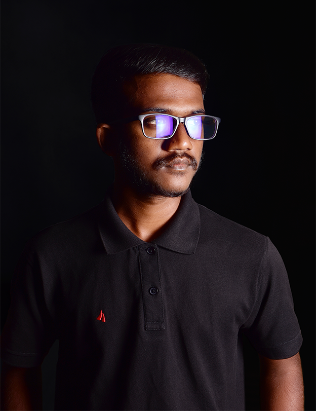

<!DOCTYPE html>
<html lang="en">
    <head>
    <meta charset="UTF-8">
    <meta http-equiv="X-UA-Compatible" content="IE-edge">
    <meta name="viewport" content="width-device-width, initial-scale=1.0">
    <title>My portfolio</title>
    <link rel="stylesheet" href="style.css">
    
    </head>
    <body>
        

        

            <nav>
                
                <ul id="sidemenu">
                    <li><a href="#header">Home</a></li>
                    <li><a href="#about">About</a></li>
                    <li><a href="#services">Services</a></li>
                    <li><a href="#portfolio">Portfolio</a></li>
                    <li><a href="#contact">Contact</a></li>
                    <i class="fas fa-times" onclick="closemenu()"></i>
                </ul>
                <i class="fas fa-bars" onclick="openmenu()"></i>
            </nav>
            

                
UI/UX Designer

                <h1>Hi, I'm Hansana Eranga From Sri lanka</h1>
            

        

        

<!-- ----------About information-------- -->
        

                

                    

                        

                        
                        

                        

                            <h1 class="sub-title">About Me</h1>
                            
I‘m a UX/UI Designer with over two years experience conceptualizing and crafting digital products,
                            helping businesses and non-profits expand their capacity for impact.
  
                            

                                
Skills

                                
Experience

                                
Education

                            

                            

                                <ul>
                                    <li>UI/UX Designing web/app interfaces</li>
                                    <li>NFT Design Create Nft Artwork</li>
                                    <li>Logo Design Company Logo,businesses</li>
                                </ul>
                            

                            

                                <ul>
                                    <li>2018-2021 Working with java institue advance technology</li>
                                    <li>2001-2022 learn and self-studies</li>
                                    <li>2019-2022 Start my own design platform</li>
                                </ul>
                            

                            

                                <ul>
                                    <li>School St'thomas collage matele</li>
                                    <li>Certificated courses ocjp-java, digital markting</li>
                                    <li>Universitys Undergraduate at Sri lanka technologycal campus</li>
                                </ul>
                            

                            

                    

                

        

        <!---------------services--------------->
        

            

                <h1 class="sub-title">My Services</h1>
                

                    

                        <i class="fa-solid fa-code"></i>
                        <h2>Web Design</h2>
                        
what's your idea into website.I'm familiar with css and javascript. And now i try to developed web using react

                            <a href="#">Learn more</a>
                    

                    

                        <i class="fa-solid fa-hippo"></i>
                        <h2>NFT Design</h2>
                        
NFT Logo Disign, 100+ Collection Genarates, 1000+ Collection Genarates

                            <a href="#">Learn more</a>
                    

                    

                        <i class="fa-solid fa-pen-nib"></i>
                        <h2>Logo Design</h2>
                        
Abstract mark, Moscot logo, combination mark, Emblem logo, Lettermark, Pictorial mark, Wordmark

                            <a href="#">Learn more</a>
                    

                

            

        

<!-----------portfolio----------->

    

        <h1 class="sub-title">My Work</h1>
        

            

                
                

                    <h3><b>Online market place App</b></h3>
                    
A long time ago I created an advertising website for selling vehicles. You can see that website in the link below.

                    <a href="https://k8zh2k8u7yunmn3gscq38w.on.drv.tw/www.Unicorn.com/HOME.html"><i class="fa-solid fa-arrow-up-right-from-square"></i></a>
                

            

            

                
                

                    <h3><b>NFT</b></h3>
                    
You can create and Genarates any type of NFT art Collection you want

                    <a href="https://www.instagram.com/p/CViK0XhPGOT/?utm_source=ig_web_copy_link"><i class="fa-solid fa-arrow-up-right-from-square"></i></a>
                

            

            

                
                

                    <h3><b>Graphic Design</b></h3>
                    
I am designing different kinds of graphic design like photoshop manipulation and flyer design. You can see an example below the link. 

                    <a href="https://www.instagram.com/hansanaeranga/"><i class="fa-solid fa-arrow-up-right-from-square"></i></a>
                

            

        

        <a href="#" class="btn">See more</a>
    

<!-------------contact-->

    

        

            

                <h1 class="sub-title">Contact Me</h1>
                
<i class="fa-sharp fa-solid fa-paper-plane"></i>hansana.eranga.jayarathna2001@gmail.com

                
<i class="fa-solid fa-square-phone-flip"></i>0756558986

                

                    <a href="https://www.facebook.com/hansana.eranga"><i class="fa-brands fa-facebook"></i></a>
                    <a href="https://twitter.com/hjayarthna"><i class="fa-brands fa-twitter-square"></i></a>
                    <a href="https://www.instagram.com/hansanaeranga/"><i class="fa-brands fa-instagram"></i></a>
                    <a href="https://www.linkedin.com/in/hansana-eranga-22500123a/?originalSubdomain=lk"><i class="fa-brands fa-linkedin"></i></a>
                

                <a href="images/my-cv.pdf" download class="btn btn2">Download Cv</a>
            

            

                <form name="submit-to-google-sheet">
                    <input type="text" name="Name" placeholder="Your Name" required>
                    <input type="email" name="Email" placeholder="Your Email" required>
                    <textarea name="Message" rows="6" placeholder="Your Message"></textarea>
                    <button type="submit" class="btn btn2">Submit</button>
                </form>
                
            

        

    

    

        
copyright @ Hansana. Made with HEJ design

    

        
        
        
    </body>
</html>
